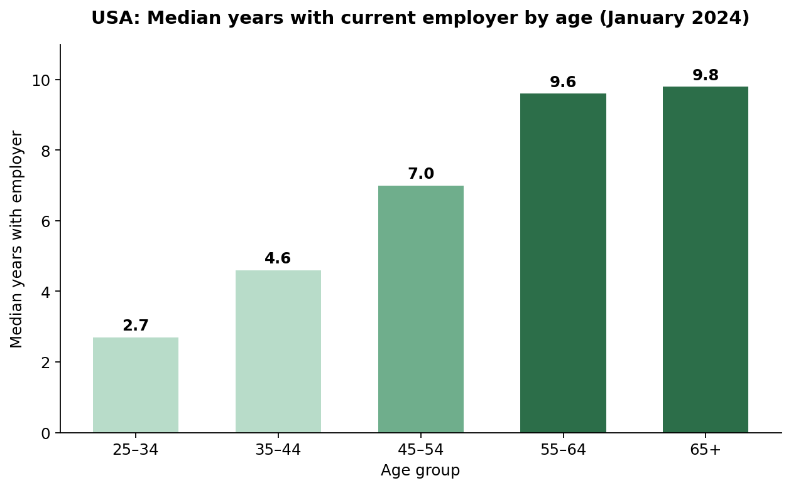
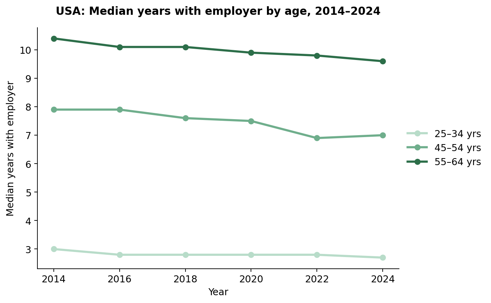
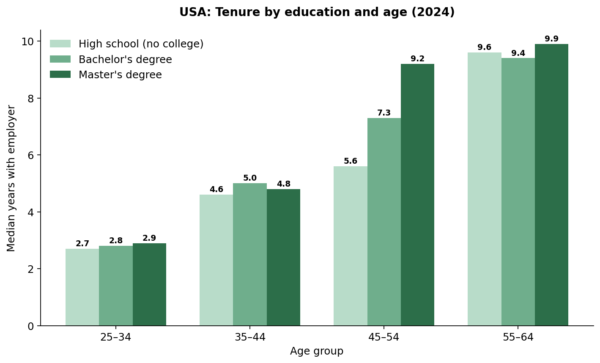
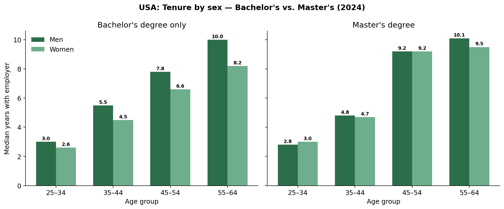
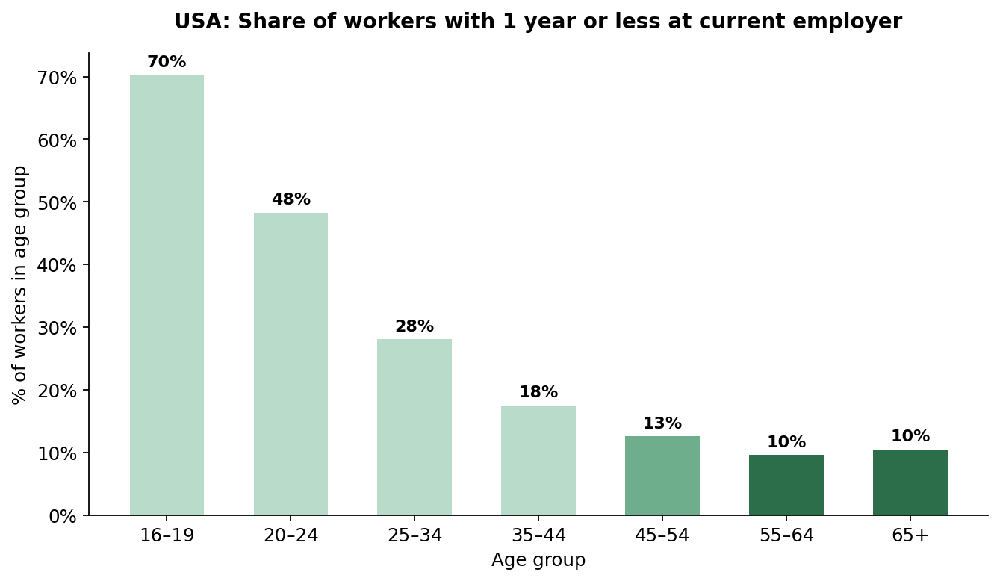
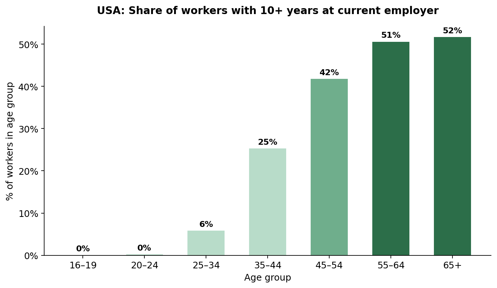
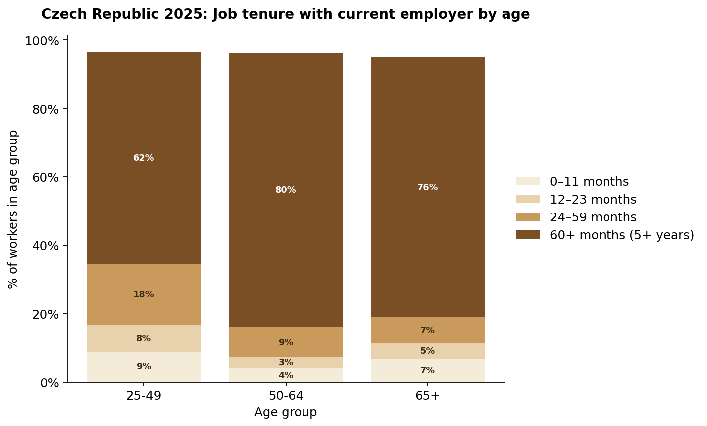
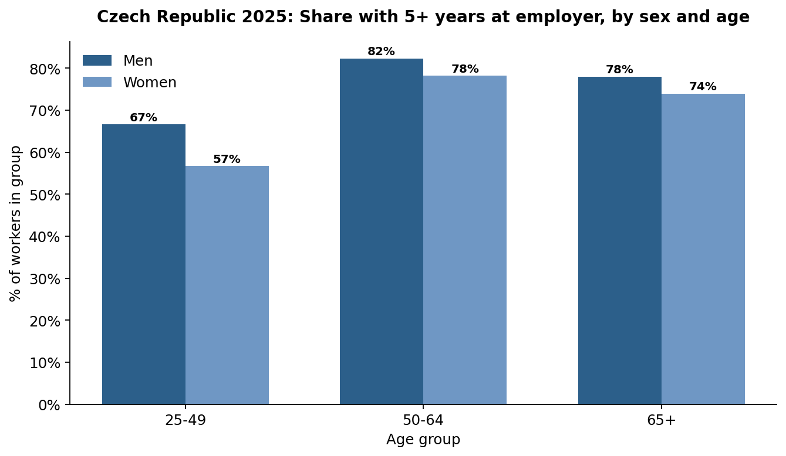

# Employment Stability of Workers 55+

*How job stability and career-change outcomes shift with age — a data analysis using real, publicly published data*

**Jana Dolečková** · Data Analyst
Analysis and deck directed through iterative prompting, with the help of Claude (Anthropic)'s agentic coding.

---

## 1. Goal

Determine whether age is linked to greater job stability, focusing on the 55+ group.

- Primarily using U.S. data on job tenure (how long someone stays with the same employer, not academic tenure) by age and education
- A secondary comparison against the best available Czech data, though considerably less detailed
- Every chart in this project is built directly from filtered survey data

---

## 2. Data sources

**BLS** — U.S. Bureau of Labor Statistics
- Employee Tenure Summary (Jan 2024) — tenure by age, sex, education
- The Economics Daily (Oct 2024) — tenure length distribution by age (primary analysis)

**EU** — Eurostat / Czech Statistical Office
- lfsa_egad — tenure data for Czechia, 2025 (secondary comparison, less granular)

---

## 3. USA — does job tenure change with age?

**2.7 → 9.8 years of median tenure**

Median tenure with an employer rises almost monotonically with age — from 2.7 years for 25–34 year-olds to 9.6–9.8 years for workers 55+.

---

## 4. USA — is the pattern consistent over time?

Not a one-off blip: the age → tenure relationship is stable across 2014–2024, tracked every two years by the BLS Employee Tenure Summary.

---

## 5. USA — does education influence stability?

Master's degree holders reach near-peak stability earlier than everyone else — a median of 9.2 years by age 45–54, already close to the 55–64 level (9.9). High-school and bachelor's-degree workers don't reach that level until 55–64.

---

## 6. USA — does tenure differ by sex among college graduates?

The gender gap in tenure narrows at higher education levels: among bachelor's degree holders aged 55–64, men lead by 1.8 years (10.0 vs. 8.2); among master's degree holders the gap shrinks to 0.6 years (10.1 vs. 9.5), and disappears entirely at age 45–54 (9.2 vs. 9.2).

---

## 7. USA — how does tenure length vary by age?

*Only 10% of workers 55–64 are in a job less than a year old, vs. 48% for 20–24 year-olds.*

*Conversely, 51% of workers 55–64 have been with their employer 10+ years.*

---

## 8. Does the same pattern appear in the Czech Republic (2025)?

**80.3% of employed 50–64 year-olds** have been with their employer 5+ years — vs. 62.1% for a derived 25–49 age group.

Eurostat's published age bands overlap; the 25–49 group was derived from published headcounts to make a fair, non-overlapping comparison. The duration bands also sum to slightly under 100% — the remainder is Eurostat's not-stated share.

---

## 9. Czech Republic — does job tenure differ by sex, as in the USA?

Job tenure differs by sex across every age group: men consistently show longer tenure than women, though the gap is largest at 25–49 and narrows from 50+ onward. No causal claim is made here — the data shows the pattern, not the reason.

---

## 10. Key takeaways

1. USA: median tenure rises almost monotonically with age — 2.7 years (25–34) to 9.6–9.8 years (55+) — and the trend is stable over 2014–2024.
2. USA: the same pattern holds for college-educated workers; education doesn't affect turnover nearly as much as age does.
3. USA: only 10% of workers 55–64 are in a job under a year old (vs. 48% for 20–24 year-olds); 51% have 10+ years of tenure.
4. Czechia (2025, secondary comparison): 80.3% of employed 50–64 year-olds have 5+ years of tenure, vs. 62.1% for a derived 25–49 group — the same pattern as the U.S., though Eurostat data is far less granular.

---

## Don't be afraid to hire 55+

Across every dataset in this analysis, employees 55+ show the longest tenure — hiring them is a bet on stability, not a risk.

*Jana Dolečková · Data Analyst*
*+420 734 163 164*

---

*Original slide deck: [employment_stability_of_workers_55plus.pptx](employment_stability_of_workers_55plus.pptx)*
